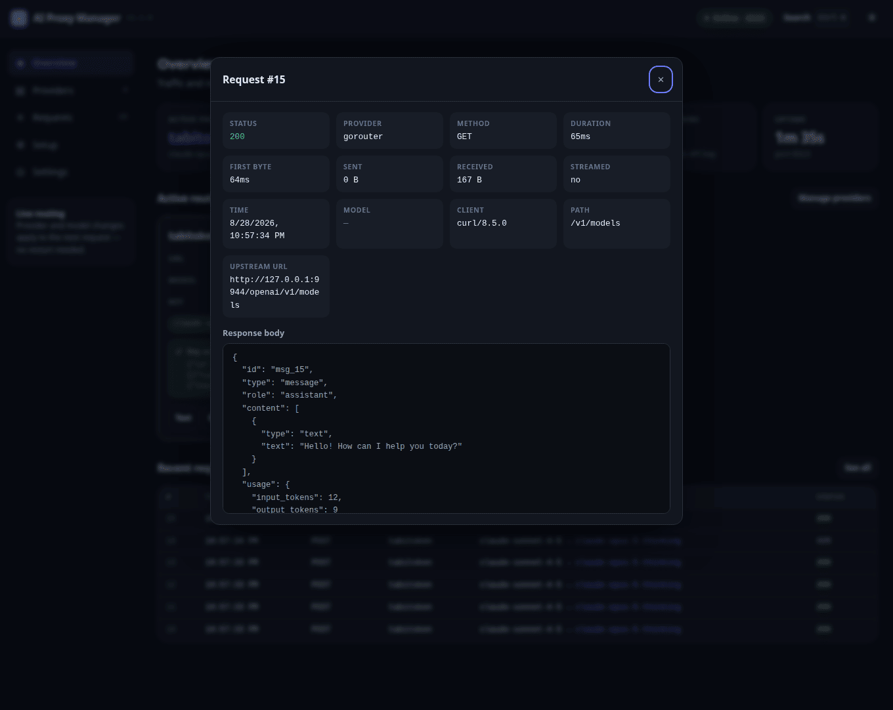
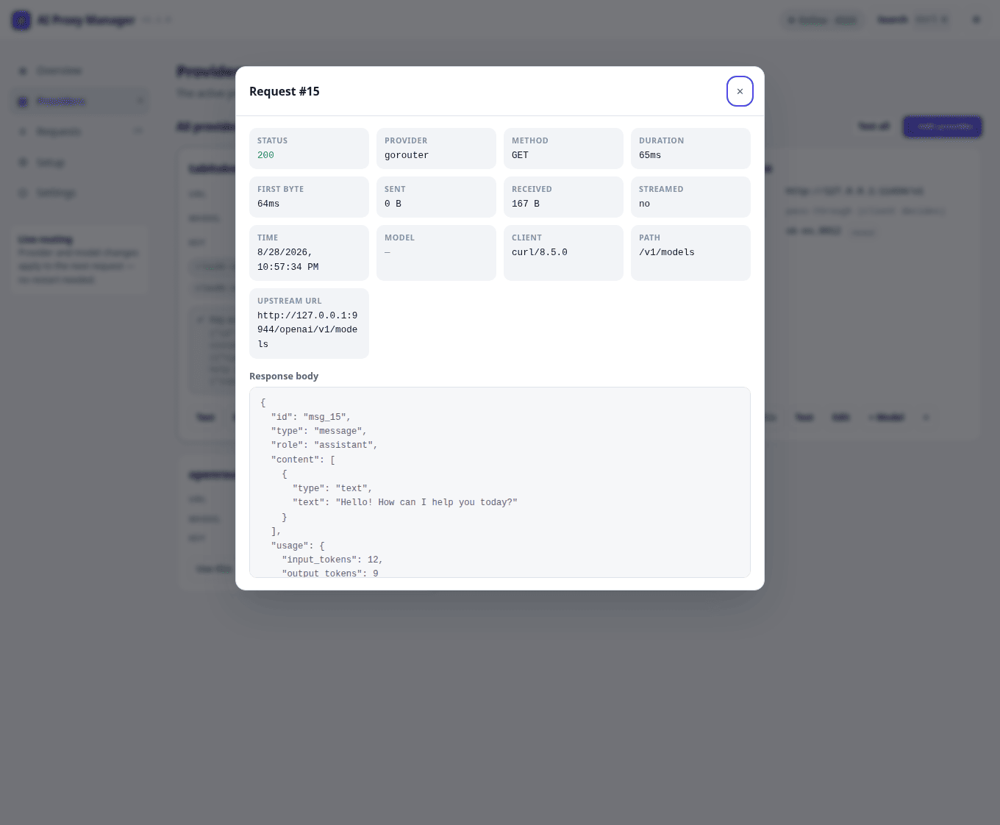
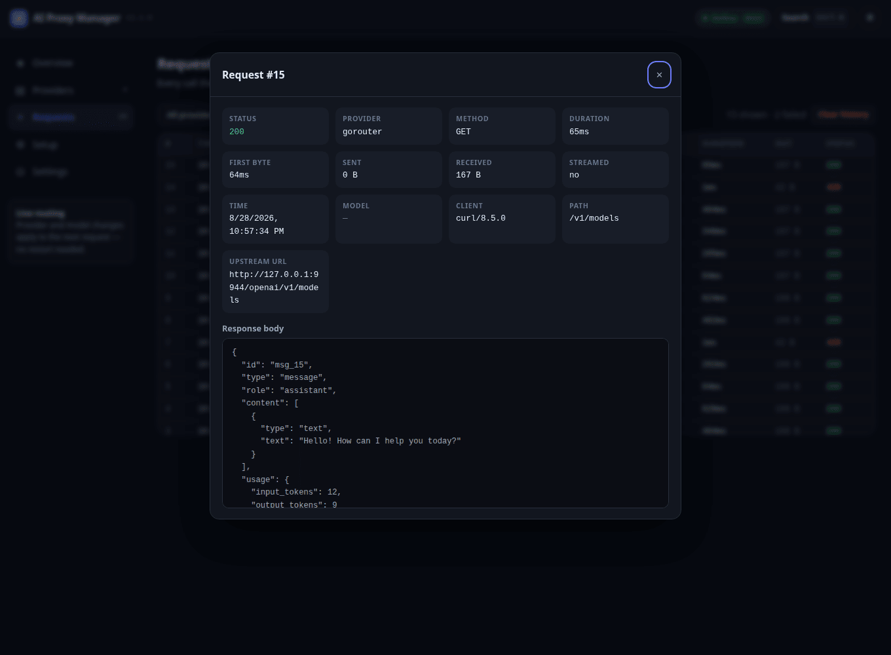

# The Dashboard

`http://127.0.0.1:8319` — served by the proxy itself, from `src/dashboard/`. Plain HTML,
CSS and JavaScript: no framework, no bundler, no dependencies, nothing to build. Reload the
page and your edit is live.

> This file replaces the original `DASHBOARD_PLAN.md`, which described the MVP before it was
> built. Everything below describes what actually ships in v1.1.0, plus the key pool, which
> is unreleased.

---

## Views

Above every view sits the **key-credit banner**, hidden until a key runs out. It rides on the
same 2-second status poll as the tiles, so an account that empties mid-request is on screen
seconds later: *"gorouter key marajul.cu.cse is out of credit ($0.71 left, $0.80 needed)"*
with a *Switch →* button. When a provider is in `auto` mode the same alert reads as news —
"Switched to … automatically", no button — because the pool has already moved on; it stays
until dismissed, so a switch that happened while you were away is not lost. A revoked key
(`401`) is shown in red instead, and never triggers automatic rotation.

### Overview

Six tiles — active provider and its pinned model, requests routed, median latency (with p95),
errors and error rate, provider count, uptime and bound port. Below them, a spotlight card
for the active route and the last six requests.

### Providers

One card per provider: URL, a model dropdown that switches the pinned model on the spot
(including a **— pass-through —** entry), a masked key with a reveal button, removable model
chips, and the actions *Use this*, *Test*, *Edit*, *+ Model*, delete. **Test** sends one real
1-token request and reports the verdict inline. **Test all** runs them in parallel.

A card is outlined green when active and red when its URL cannot be parsed.

A provider holding more than one account also gets a **Pool** row: the account in use with
its last known balance, a `N keys · N spent · N dead` count, *next key*, *retire*, and an
`auto` toggle that decides who switches when an account runs out — the banner and you
(`manual`, the default), or the proxy inside the request that found it empty (`auto`). Turning
`auto` on is worth doing only after `ai-proxy keys check` has shown what that relay actually
says when a balance runs dry. Importing, checking and exporting keys stay on the CLI: the
first two run for minutes and want streaming progress, which a 2-second poll cannot show.
See **[KEYS.md](KEYS.md)**.

### Requests

Every forwarded call with time, method, provider, model swap, duration, bytes and status,
filterable by provider and outcome. Selecting a row opens the inspector: timings including
time to first byte, byte counts, the resolved upstream URL, the calling tool, and the
request and response bodies pretty-printed.

### Setup

Live detection of whether each integration is applied, and to which port — so a stale block
after `set-port` is visible rather than mysterious. Buttons apply or remove the shell block
and sync VS Code, and there is a copyable block of manual settings for any other tool.

### Settings

The `settings` object from `config.json`: header spoofing, log persistence, body capture,
timeouts, history size and port, plus config export/import and clearing history. Everything
writes to the same file the CLI uses.

---

## Keyboard

| | |
|:---|:---|
| `Ctrl`/`⌘` + `K` | Command palette — switch provider or model, run a test, jump to a view, toggle the theme |
| `↑` `↓` `↵` | Move and run inside the palette |
| `Esc` | Close any dialog or the palette |
| `Tab` | Cycles inside the open dialog only (focus trap) |
| `↵` / `Space` | Open the inspector for the focused request row |

Themes cycle **system → light → dark**, persist in `localStorage`, and are mirrored into
`config.json` so a fresh browser starts on the same theme.

---

## How the client is put together

`app.js` is one file, ordered: utilities → state → API helper → theme → router → overlay
manager → data plumbing → renderers → operations → palette → event wiring → boot.

Four conventions are load-bearing. Breaking them reintroduces bugs this project has already
had:

**1. No inline `onclick`.** Every interactive element carries `data-action` (plus
`data-name` / `data-model`), and a single delegated listener on `document` dispatches through
the `ACTIONS` table. Two past bugs came from interpolating values into inline handlers — a
provider name or JSON containing a quote broke the attribute.

**2. Renders are signature-guarded.** Each renderer builds a JSON signature of its inputs and
returns early when nothing changed, so the 2-second poll does not rebuild the DOM. Adding a
render path that ignores this makes the UI fight the user.

**3. The provider grid refuses to redraw when it would steal focus** — while any dialog is
open, or while an open `<select>` inside it has focus. After a legitimate redraw, focus is
restored via `data-focus-key`. Without this, changing a model was impossible: the dropdown
closed 2 seconds after opening.

**4. Dialogs go through `showOverlay` / `hideOverlay`.** They set `aria-modal`, trap Tab,
close on Escape and on a backdrop click, and restore focus to the element that opened them.
`confirmDialog()` returns a promise and resolves `false` when dismissed — it replaces
`window.confirm`, which blocked the poll loop and could not be styled.

Polling pauses entirely while `document.hidden`.

## Styling

`style.css` defines design tokens under `:root[data-theme="dark"]` and
`:root[data-theme="light"]` — surfaces, borders, text tiers, accent, and ok/warn/danger
pairs. Components reference tokens only, so a new theme is a third token block and nothing
else. There is a `prefers-reduced-motion` guard, and a `@media (max-width: 900px)` breakpoint
that turns the sidebar into a horizontal tab strip.

## Adding a view

1. Add a `<button class="nav-item" data-view="x">` and a `<section class="view" id="view-x" hidden>`.
2. Add `'x'` to the list in `initRouter()`.
3. Write `renderX()` with a signature guard, and call it from `renderAll()`.
4. Fetch what it needs in the existing poll, or on first activation if it is expensive.
